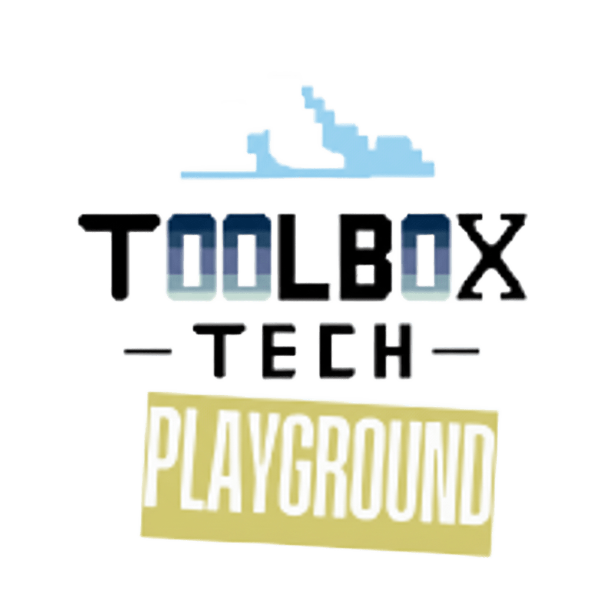

<p align="center"> 
  
</p>

# 🚀 Kubernetes na Prática - Curso Hands-On

> Aprenda Kubernetes através de laboratórios práticos, do básico ao avançado

[](https://kubernetes.io/)
[](https://kind.sigs.k8s.io/)
[](https://github.com/PowerShell/PowerShell)
[](LICENSE)

---

## 📚 Sobre o Curso

Este curso foi desenvolvido para ensinar **Kubernetes de forma prática**, através de laboratórios hands-on que você pode executar localmente no seu próprio computador. Cada módulo combina teoria essencial com exercícios práticos reais.

**Filosofia do curso:**
- 🎯 **Hands-on first**: Aprenda fazendo, não apenas lendo
- 🔧 **Local development**: Tudo roda no seu laptop (Kind + Docker)
- 📊 **Casos reais**: Aplicações e cenários do mundo real
- 🚀 **Progressivo**: Do básico ao avançado, passo a passo
- ✋ **100% Manual**: Todos os comandos kubectl executados manualmente para melhor aprendizado

---

## 💡 Por Que Este Curso Vai Fazer Seus Olhos Brilharem

### 👨‍🎓 Para Estudantes de DevOps

Imagine entrar em uma entrevista e dizer: *"Eu não apenas sei teoria de Kubernetes, eu já fiz deploy de aplicações reais, testei resiliência deletando pods, configurei auto-scaling e vi tudo funcionando na minha máquina!"*

**O que você ganha:**
- ✨ **Portfolio prático**: Projetos reais para mostrar no GitHub
- 🎮 **Aprendizado divertido**: Deploy de jogos (Super Mario, 2048) em vez de "Hello World"
- 🔧 **Habilidades de mercado**: Exatamente o que empresas procuram
- 💪 **Confiança**: Você realmente sabe como fazer, não apenas decorou slides

### 👔 Para Tech Managers e Engenheiros

Você está preocupado com:
- 📈 "Como vou escalar meus serviços quando o tráfego aumentar 10x?"
- 🔥 "O que acontece se um servidor cair às 3h da manhã?"
- 💰 "Como otimizo custos sem sacrificar disponibilidade?"

**Este curso mostra na prática:**
- ✅ **Auto-scaling real**: Veja pods sendo criados automaticamente sob carga
- ✅ **Auto-healing comprovado**: Delete um pod, veja outro subir em 10 segundos
- ✅ **Zero downtime**: Aplicação continua funcionando durante falhas
- ✅ **ROI rápido**: Em 1 hora você já entende como Kubernetes resolve esses problemas

### 🎯 O Diferencial

Este não é mais um curso teórico. Você vai:

1. **Ver com seus próprios olhos**: Pod sendo deletado → novo pod criando → aplicação funcionando
2. **Sentir na pele**: Gerar carga → CPU subindo → HPA criando mais pods → carga distribuída
3. **Provar para si mesmo**: Não precisa acreditar, você vai testar e validar cada conceito

**Como disse um aluno:**
> "Quando eu vi meu jogo de Super Mario continuando a funcionar mesmo depois de deletar metade dos pods, eu finalmente entendi o poder do Kubernetes. Não foi em slides, foi acontecendo na minha tela!" 

---

## 🎓 Módulos do Curso

### 📦 Módulo 00: Fundamentos de Docker
**Pré-requisito** | **Duração:** 1 hora

Conceitos fundamentais de containers e Docker necessários para entender Kubernetes.

📖 [Ver conteúdo →](./curso-k8s/modulo-00-docker/)

**O que você vai aprender:**
- O que são containers e por que usá-los
- Docker images, containers e registry
- Dockerfile e build de imagens
- Networking e volumes no Docker

---

### 🐳 Módulo 01: Cluster Kubernetes Local com Kind
**Iniciante** | **Duração:** 2 horas

Aprenda a criar e gerenciar clusters Kubernetes locais usando Kind (Kubernetes in Docker).

📖 [Ir para módulo →](./curso-k8s/modulo-01-kind/)

**O que você vai aprender:**
- ✅ Instalar e configurar Kind
- ✅ Criar clusters single-node e multi-node
- ✅ Configurar networking básico
- ✅ Gerenciar múltiplos clusters
- ✅ Troubleshooting de problemas comuns

**Laboratórios incluídos:**
- [Lab 01: Primeiro Cluster](./curso-k8s/modulo-01-kind/laboratorios/lab-01-primeiro-cluster.md)
- [Lab 02: Cluster Multi-Node](./curso-k8s/modulo-01-kind/laboratorios/lab-02-multi-node.md)
- [Lab 03: Cluster Ingress-Ready](./curso-k8s/modulo-01-kind/laboratorios/lab-03-ingress-ready.md)
- [Lab 04: Múltiplos Clusters](./curso-k8s/modulo-01-kind/laboratorios/lab-04-multiplos-clusters.md)

---

### 🎮 Módulo 02: Deploy de Aplicação e Resiliência
**Intermediário** | **Duração:** 1h15min | **✨ NOVO!**

Vá além da criação de clusters! Faça deploy de aplicações reais (**jogos Super Mario e 2048**) e explore os recursos de **auto-healing** e **auto-scaling** do Kubernetes.

📖 [Ir para módulo →](./curso-k8s/modulo-02-deploy-app/)

**O que você vai aprender:**
- ✅ Fazer deploy de aplicações containerizadas
- ✅ Expor serviços para acesso externo (ClusterIP + port-forward)
- ✅ Compreender auto-healing na prática
- ✅ Configurar Horizontal Pod Autoscaler (HPA)
- ✅ Executar testes de carga e resiliência
- ✅ Monitorar métricas em tempo real

**Guia prático:**
- 📚 [Manifests README: Guia Completo](./curso-k8s/modulo-02-deploy-app/manifests/README.md)

**Destaques do módulo:**
- 🎮 **Aplicação real**: Super Mario rodando em Kubernetes!
- 🔧 **Auto-healing**: Delete pods e veja a recuperação automática
- 📈 **Auto-scaling**: Gere carga e observe o scaling em tempo real
- 📊 **Metrics Server**: Configuração e uso de métricas
- 🔥 **Testes de stress**: Use Fortio para gerar carga profissional

**Início rápido com Super Mario:**
```powershell
# 1. Criar cluster local com Kind
kind create cluster --config curso-k8s/modulo-01-kind/manifests/cluster-config.yaml

# 2. Instalar Metrics Server
kubectl apply -f https://github.com/kubernetes-sigs/metrics-server/releases/latest/download/components.yaml
kubectl patch deployment metrics-server -n kube-system --type='json' -p='[{"op":"add","path":"/spec/template/spec/containers/0/args/-","value":"--kubelet-insecure-tls"}]'
kubectl wait --for=condition=available --timeout=120s deployment/metrics-server -n kube-system

# 3. Deploy do Super Mario
kubectl create namespace games
kubectl apply -f curso-k8s/modulo-02-deploy-app/manifests/01-deployment-mario.yaml
kubectl apply -f curso-k8s/modulo-02-deploy-app/manifests/02-service-mario.yaml
kubectl apply -f curso-k8s/modulo-02-deploy-app/manifests/03-hpa.yaml

# 4. Acessar o Super Mario
Start-Process "http://localhost:8080"   

# 5. Alternativa: Port-Forward se não abrir automaticamente
kubectl port-forward -n games service/super-mario-service 8080:8080

# 6. Abrir no navegador
Start-Process "http://localhost:8080"
```

---

## 🛠️ Pré-requisitos

### Software Necessário

| Software | Versão Mínima | Download |
|----------|---------------|----------|
| **Docker Desktop** | 24.0+ | [docker.com](https://www.docker.com/products/docker-desktop) |
| **Kind** | 0.20.0+ | [kind.sigs.k8s.io](https://kind.sigs.k8s.io/docs/user/quick-start/) |
| **kubectl** | 1.28.0+ | [kubernetes.io](https://kubernetes.io/docs/tasks/tools/) |
| **PowerShell** | 5.1+ ou Core 7+ | [github.com/PowerShell](https://github.com/PowerShell/PowerShell) |

### Recursos do Sistema

- **CPU**: 2+ cores (4+ recomendado)
- **RAM**: 4GB disponível (8GB+ recomendado)
- **Disco**: 20GB espaço livre
- **SO**: Windows 10/11, macOS, ou Linux

### 📝 Diferenciais do Curso

- ✅ **YAMLs 100% Comentados**: Todos os manifestos Kubernetes possuem comentários linha por linha explicando cada campo
- ✅ **Abordagem Manual**: Sem scripts de automação - você executa cada comando kubectl para internalizar
- ✅ **Ferramentas Profissionais**: Fortio (usado pelo Istio), Metrics Server, Kind
- ✅ **Documentação Completa**: README.md detalhado + RESUMO.md para consulta rápida
- ✅ **Casos Reais**: Aplicações web interativas (Super Mario) em vez de exemplos artificiais

### Verificação Rápida

```powershell
# Docker
docker --version
docker ps

# Kind
kind version

# kubectl
kubectl version --client

# PowerShell
$PSVersionTable.PSVersion
```

---

## 🚀 Início Rápido

### Para Iniciantes

Se você está começando do zero:

```powershell
# 1. Clone este repositório
git clone <url-do-repo>
cd k8s-caio

# 2. Leia os fundamentos de Docker (opcional)
cat curso-k8s\modulo-00-docker\README.md

# 3. Comece pelo Módulo 01
cd curso-k8s\modulo-01-kind
cat README.md

# 4. Faça o primeiro lab
cd laboratorios
cat lab-01-primeiro-cluster.md
```

### Para Quem Já Conhece o Básico

Se você já sabe o que é Kubernetes:

```powershell
# Vá direto para o Módulo 02 (deploy e resiliência)
cd curso-k8s\modulo-02-deploy-app

# Leia o README
cat README.md

# Execute o lab completo
cd laboratorios
cat lab-completo-resiliencia.md

# Siga os comandos kubectl passo a passo
# Todos os comandos estão documentados e prontos para uso
```

---

## 📖 Como Usar Este Curso

### Estrutura de Cada Módulo

```
modulo-XX-nome/
├── README.md              # Visão geral e conceitos
├── QUICK-START.md         # Guia de início rápido
├── laboratorios/          # Labs hands-on
│   ├── lab-01-*.md
│   ├── lab-02-*.md
│   └── ...
└── manifests/             # Arquivos YAML Kubernetes
    ├── deployment.yaml    # Com comentários explicativos
    ├── service.yaml       # Linha por linha
    ├── hpa.yaml           # Totalmente documentado
    └── README.md          # Guia dos manifestos
```

### Fluxo de Aprendizado Recomendado

```
1. 📖 Ler README do módulo
   ↓
2. 🧠 Entender conceitos fundamentais
   ↓
3. 🔧 Seguir laboratórios passo-a-passo
   ↓
4. 🧪 Experimentar e modificar
   ↓
5. 📝 Fazer anotações e documentar aprendizados
   ↓
6. 🎯 Completar todos os labs do módulo
   ↓
7. ⏭️  Avançar para próximo módulo
```

### Dicas de Estudo

- ✅ **Não pule os labs**: A prática é essencial
- ✅ **Experimente variações**: Modifique configurações e observe resultados
- ✅ **Execute manualmente**: Digite cada comando kubectl para internalizar
- ✅ **Leia os YAMLs comentados**: Entenda cada linha dos manifestos
- ✅ **Consulte a documentação oficial**: Links fornecidos em cada módulo
- ✅ **Anote comandos úteis**: Use o RESUMO.md como referência rápida

---

## 🎯 Objetivos de Aprendizado

Ao completar este curso, você será capaz de:

### Nível Básico (Módulos 00-01)
- ✅ Entender arquitetura de Kubernetes
- ✅ Criar e gerenciar clusters locais
- ✅ Trabalhar com recursos básicos (Pods, Deployments, Services)
- ✅ Fazer troubleshooting básico

### Nível Intermediário (Módulo 02)
- ✅ Deployar aplicações completas em Kubernetes
- ✅ Configurar auto-scaling e auto-healing
- ✅ Entender e usar métricas
- ✅ Implementar serviços resilientes
- ✅ Executar testes de carga e validação

---

## 🤝 Contribuindo

Contribuições são bem-vindas! Se você encontrou um erro, tem uma sugestão ou quer adicionar conteúdo:

1. Abra uma issue descrevendo o problema/sugestão
2. Fork o repositório
3. Crie uma branch para sua feature
4. Faça commit das mudanças
5. Abra um Pull Request

### Áreas para Contribuição

- 📝 Correções de typos e melhorias de documentação
- 🧪 Novos laboratórios e exercícios
- � Mais comentários e explicações nos YAMLs
- 🌐 Traduções para outros idiomas
- 📊 Diagramas e visualizações
- 🎮 Mais aplicações de exemplo

---

## 📞 Suporte

### Encontrou um problema?

- 🐛 **Bugs**: Abra uma issue no GitHub
- ❓ **Dúvidas**: Consulte a documentação ou abra uma discussion
- 💡 **Sugestões**: Issues ou discussions são bem-vindas

### Recursos Adicionais

- [Documentação Oficial Kubernetes](https://kubernetes.io/docs/)
- [Kind Documentation](https://kind.sigs.k8s.io/)
- [Kubectl Cheat Sheet](https://kubernetes.io/docs/reference/kubectl/cheatsheet/)
- [Kubernetes Patterns](https://k8spatterns.io/)

---

## 📝 Licença

Este projeto está sob a licença MIT. Veja arquivo [LICENSE](LICENSE) para mais detalhes.

---

## 🙏 Agradecimentos

Este curso foi inspirado por:
- Comunidade Kubernetes
- Projetos de exemplo do Google Cloud Skills
- Feedback de alunos e praticantes de K8s

---

<div align="center">

## 🚀 Comece Agora!

**Escolha seu caminho:**

[🎓 Iniciante: Módulo 01](./curso-k8s/modulo-01-kind/) | [🎮 Intermediário: Módulo 02](./curso-k8s/modulo-02-deploy-app/) | [📖 Fundamentos Docker](./curso-k8s/modulo-00-docker/)

---

**Feito com ❤️ para a comunidade Kubernetes**

⭐ Se este curso foi útil, dê uma estrela no repositório!

</div>
