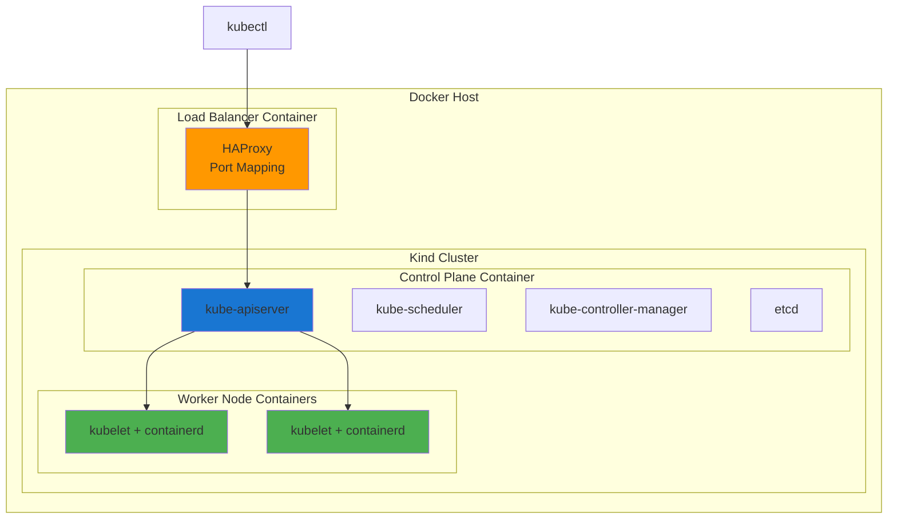

# 🐳 Módulo 01: Cluster Kubernetes Local com Kind

## 📚 Visão Geral

Neste primeiro módulo, você aprenderá a criar e gerenciar clusters Kubernetes locais usando Kind (Kubernetes in Docker). Este é o alicerce de toda nossa jornada - um ambiente de desenvolvimento confiável e reproduzível.

## 🎯 Objetivos de Aprendizado

Ao final deste módulo, você será capaz de:

- ✅ Entender o que é Kind e suas vantagens
- ✅ Instalar e configurar Kind no seu sistema
- ✅ Criar clusters single-node e multi-node
- ✅ Configurar networking básico para LoadBalancer
- ✅ Gerenciar múltiplos clusters
- ✅ Fazer troubleshooting de problemas comuns

## ⏱️ Duração Estimada: 2 horas

## 📋 Pré-requisitos

- Docker Desktop ou Docker Engine instalado
- Linha de comando básica (Bash/PowerShell)
- 4GB RAM disponível
- 10GB espaço em disco

## 🧠 Conceitos Fundamentais

### O que é Kind?

**Kind** (Kubernetes in Docker) é uma ferramenta para executar clusters Kubernetes locais usando containers Docker como "nós". Foi projetado principalmente para:

- **Desenvolvimento local** de aplicações Kubernetes
- **Testes de integração** contínua (CI)
- **Educação** e aprendizado de Kubernetes
- **Prototipagem** rápida de configurações

### Vantagens do Kind

| Vantagem | Descrição |
|----------|-----------|
| **🚀 Rápido** | Clusters criados em segundos |
| **🔄 Reproduzível** | Configuração declarativa via YAML |
| **💡 Leve** | Usa containers em vez de VMs |
| **🔧 Flexível** | Suporte a multi-node e configurações avançadas |
| **🧪 Isolado** | Não interfere com outros clusters |

### Arquitetura do Kind



## 🛠️ Laboratório Prático

### Passo 1: Instalação do Kind

#### Windows (PowerShell)
```powershell
# Via Chocolatey
choco install kind

# Via manual download
curl.exe -Lo kind-windows-amd64.exe https://kind.sigs.k8s.io/dl/v0.20.0/kind-windows-amd64
Move-Item .\kind-windows-amd64.exe c:\some-dir-in-your-PATH\kind.exe
```

#### Linux/macOS
```bash
# Via package manager (Linux)
curl -Lo ./kind https://kind.sigs.k8s.io/dl/v0.20.0/kind-linux-amd64
chmod +x ./kind
sudo mv ./kind /usr/local/bin/kind

# Via Homebrew (macOS)
brew install kind
```

#### Verificação
```bash
kind version
kubectl version --client
docker --version
```

### Passo 2: Primeiro Cluster Single-Node

```bash
# Criar cluster simples
kind create cluster --name meu-primeiro-cluster

# Verificar cluster
kubectl cluster-info --context kind-meu-primeiro-cluster

# Listar nós
kubectl get nodes

# Verificar pods do sistema
kubectl get pods -n kube-system
```

**🔍 O que aconteceu?**
- Kind criou um container Docker funcionando como nó único
- Kubernetes control plane foi instalado e configurado
- kubectl foi configurado automaticamente para o novo cluster

### Passo 3: Cluster Multi-Node Avançado

Crie o arquivo `cluster-config.yaml`:

```yaml
kind: Cluster
apiVersion: kind.x-k8s.io/v1alpha4
name: k8s-essentials

networking:
  podSubnet: "10.244.0.0/16"
  serviceSubnet: "10.96.0.0/12"
  kubeProxyMode: "ipvs"

nodes:
  - role: control-plane
    extraPortMappings:
    - containerPort: 80
      hostPort: 30080
      protocol: TCP
    - containerPort: 443
      hostPort: 30443
      protocol: TCP

  - role: worker
  - role: worker
```

#### 📋 Explicação Detalhada da Configuração

**Linha 1-2: Tipo e Versão da API**
```yaml
kind: Cluster
apiVersion: kind.x-k8s.io/v1alpha4
```
- `kind: Cluster` - Define que este YAML é uma configuração de **Cluster** do Kind
- `apiVersion` - Especifica a versão v1alpha4 da API (única versão suportada atualmente)

**Linha 3: Nome do Cluster**
```yaml
name: k8s-essentials
```
- Identificador usado em comandos: `kubectl config use-context kind-k8s-essentials`
- Prefixo dos containers Docker: `k8s-essentials-control-plane`, `k8s-essentials-worker`

**Linha 5-8: Configuração de Networking**
```yaml
networking:
  podSubnet: "10.244.0.0/16"
  serviceSubnet: "10.96.0.0/12"
  kubeProxyMode: "ipvs"
```

| Parâmetro | Descrição | Impacto |
|-----------|-----------|--------|
| `podSubnet` | Range CIDR para IPs dos pods (65.536 endereços) | Cada node recebe uma fatia dessa rede |
| `serviceSubnet` | Range CIDR para ClusterIPs (1.048.576 endereços) | Permite muito mais serviços que o padrão /16 |
| `kubeProxyMode` | Modo IPVS para proxy de rede | ✅ Melhor performance<br>⚠️ Requer módulos kernel IPVS |

**Linha 10-20: Control Plane com Port Mappings**
```yaml
nodes:
  - role: control-plane
    extraPortMappings:
    - containerPort: 80
      hostPort: 30080
    - containerPort: 443
      hostPort: 30443
```

- **Control Plane**: Executa API Server, Scheduler, Controller Manager e etcd
- **Port Mapping 80→30080**: Acessa serviços HTTP via `localhost:30080`
- **Port Mapping 443→30443**: Acessa serviços HTTPS via `localhost:30443`

**Linha 22-23: Workers**
```yaml
  - role: worker
  - role: worker
```
- Dois nodes adicionais para executar cargas de trabalho (pods)
- Permitem testar distribuição de carga e rolling updates

#### ⏱️ Características de Performance

| Aspecto | Impacto no Tempo de Criação |
|---------|-----------------------------|
| **Multi-node (3 containers)** | ⏱️ +30-40s (vs single-node) |
| **IPVS mode** | ⏱️ +10-20s (carrega módulos kernel) |
| **Port mappings** | ⏱️ +5-10s (configuração de rede) |
| **Total esperado** | 🕐 60-120 segundos |

```bash
# Criar cluster com configuração personalizada
kind create cluster --config cluster-config.yaml

# Verificar nós e labels
kubectl get nodes --show-labels

# Verificar mapeamento de portas
docker ps | grep k8s-essentials # Linux
docker ps | Select-String -Pattern "k8s-essentials" # Windows
```

### Passo 4: Configuração de Contexto e Multi-Cluster

```bash
# Listar clusters existentes
kind get clusters

# Criar segundo cluster para demonstração
kind create cluster --name cluster-dev

# Listar contextos kubectl
kubectl config get-contexts

# Alternar entre clusters
kubectl config use-context kind-k8s-essentials
kubectl config use-context kind-cluster-dev

# Verificar cluster atual
kubectl config current-context

# Executar comandos em contexto específico
kubectl get nodes --context kind-k8s-essentials
kubectl get nodes --context kind-cluster-dev

# Remover o cluster extra
kind delete cluster --name cluster-dev

# Configurar o contexto padrão de volta
kubectl config use-context kind-k8s-essentials
```

### 🌐 Entendendo o Mapeamento de Portas no Kind

Antes de testar aplicações, é fundamental entender **como o Kind expõe serviços** para o host Windows. Existem 3 conceitos diferentes que podem causar confusão:

#### 📖 Os Três Tipos de Exposição de Portas

**1️⃣ extraPortMappings (Configuração do Kind)**
- **O que é**: Mapeia portas do **container Docker** para o **host** (Windows/Linux/Mac)
- **Onde configurar**: No arquivo `cluster-config.yaml`
- **Exemplo**: 
  ```yaml
  extraPortMappings:
  - containerPort: 80    # Porta dentro do container Docker
    hostPort: 30080      # Porta no seu computador
  ```
- **Como funciona**: Docker mapeia `localhost:30080` → `container:80`
- **Limitação**: Só funciona no node onde foi configurado (normalmente control-plane)

**2️⃣ HostPort (Kubernetes)**
- **O que é**: Vincula a porta do **pod** diretamente à porta do **node**
- **Onde configurar**: No manifest do Pod
- **Exemplo**:
  ```yaml
  ports:
  - containerPort: 80
    hostPort: 80        # Pod usa a porta 80 do node
  ```
- **Como funciona**: Pod ocupa a porta 80 do node (que pode estar mapeada via extraPortMappings)
- **Limitação**: Só pode ter 1 pod usando aquela porta por node

**3️⃣ NodePort (Kubernetes Service)**
- **O que é**: Service que aloca uma porta no range 30000-32767 em **todos os nodes**
- **Onde configurar**: No Service com `type: NodePort`
- **Exemplo**:
  ```yaml
  type: NodePort
  ports:
  - port: 80
    nodePort: 31234    # Porta aleatória ou específica
  ```
- **Como funciona**: Kubernetes roteia tráfego da porta do node para os pods
- **Limitação**: No Kind, essa porta **NÃO** está mapeada para o host automaticamente

#### 🔄 Fluxo de Tráfego Completo

**Cenário: Acessar NGINX via localhost:30080**

```
┌─────────────────────────────────────────────────────────────────┐
│  Seu Navegador (Windows)                                        │
│  http://localhost:30080                                         │
└────────────────────┬────────────────────────────────────────────┘
                     │
                     │ ① extraPortMappings (Kind)
                     │    hostPort: 30080 → containerPort: 80
                     ▼
┌─────────────────────────────────────────────────────────────────┐
│  Container Docker: k8s-essentials-control-plane                 │
│  Porta 80 do container                                          │
└────────────────────┬────────────────────────────────────────────┘
                     │
                     │ ② HostPort (Kubernetes)
                     │    containerPort: 80 → hostPort: 80
                     ▼
┌─────────────────────────────────────────────────────────────────┐
│  Pod: nginx-hostport                                            │
│  Porta 80 do nginx                                              │
│  🌐 Welcome to nginx!                                           │
└─────────────────────────────────────────────────────────────────┘
```

#### 🆚 Comparação Prática

| Característica | extraPortMappings | HostPort | NodePort |
|----------------|-------------------|----------|----------|
| **Configurado em** | cluster-config.yaml | Pod manifest | Service manifest |
| **Camada** | Docker/Kind | Kubernetes | Kubernetes |
| **Range de portas** | Qualquer | Qualquer | 30000-32767 |
| **Acesso no host** | ✅ Sim (localhost) | ✅ Sim (se + extraPortMappings) | ❌ Não (só interno) |
| **Escala** | Não escala | 1 pod por node | Múltiplos pods |
| **Uso comum** | Ingress, desenvolvimento | Debugging, testes | Produção (com LB) |

#### 💡 Regras de Ouro para Iniciantes

1. **Quer acessar do navegador Windows?** → Use **extraPortMappings + HostPort**
2. **Está testando rápido?** → Use **kubectl port-forward** (mais simples!)
3. **Em produção?** → Use **NodePort + LoadBalancer** ou **Ingress**
4. **Múltiplos pods?** → **NÃO** use HostPort (use NodePort/Ingress)

#### 🎯 Exemplo Prático: Quando Usar Cada Um

**Cenário A: Desenvolvimento Local (1 pod)**
```yaml
# ✅ MELHOR: extraPortMappings + HostPort
# Acessa via localhost:30080
extraPortMappings:
- containerPort: 80
  hostPort: 30080

# No pod:
ports:
- containerPort: 80
  hostPort: 80
```

**Cenário B: Teste Rápido**
```bash
# ✅ MELHOR: Port Forward (sem configuração!)
kubectl port-forward pod/nginx 8080:80
# Acessa via localhost:8080
```

**Cenário C: Múltiplos Pods (Produção)**
```yaml
# ✅ MELHOR: Service NodePort + Ingress Controller
# NodePort expõe, Ingress roteia
type: NodePort
```

### Passo 5: Testando o Cluster

#### Teste 1: Deploy de Aplicação Simples

**Método 1: Usando NodePort (porta aleatória)**
```bash
# Criar deployment de teste
kubectl create deployment nginx-test --image=nginx:latest

# Ver a criação do pod
kubectl get pods -l app=nginx-test -o wide
# Aguarde até o STATUS ser "Running"

# Expor como NodePort
kubectl expose deployment nginx-test --port=80 --type=NodePort

# Obter a porta do NodePort atribuída (exemplo: 31790)
kubectl get svc nginx-test

# ⚠️ NodePort NÃO usa as portas extraPortMappings!
# Acesse via porta do node interno (não funciona diretamente no localhost)
# Para testar, use port-forward:
kubectl port-forward svc/nginx-test 8080:80

# Em outro terminal, teste:
curl http://localhost:8080
```

**Método 2: Usando as Portas Mapeadas (30080/30443) com HostPort**
```bash
# Limpar o teste anterior
kubectl delete deployment nginx-test
kubectl delete svc nginx-test

# Criar Pod com HostPort (usa a porta mapeada do cluster-config.yaml)
cat <<EOF | kubectl apply -f -
apiVersion: v1
kind: Pod
metadata:
  name: nginx-hostport
  labels:
    app: nginx-hostport
spec:
  # ⚠️ Importante: precisa rodar no control-plane onde a porta está mapeada
  nodeSelector:
    node-role.kubernetes.io/control-plane: ""
  tolerations:
  - key: node-role.kubernetes.io/control-plane
    effect: NoSchedule
  containers:
  - name: nginx
    image: nginx:latest
    ports:
    - containerPort: 80
      hostPort: 80  # Mapeia para a porta 80 do node (que está mapeada para 30080 no host)
      protocol: TCP
EOF

# Aguardar o pod iniciar
kubectl wait --for=condition=Ready pod/nginx-hostport --timeout=60s
> Resposta esperada: pod/nginx-hostport condition met

# ✅ Agora acesse via porta mapeada!
curl http://localhost:30080
# Ou no navegador: http://localhost:30080
```

**💡 Como Funciona o Mapeamento de Portas?**

No [`cluster-config.yaml`](manifests/cluster-config.yaml), configuramos:
```yaml
extraPortMappings:
- containerPort: 80      # Porta DENTRO do container Docker
  hostPort: 30080        # Porta no host Windows
```

**Fluxo de tráfego:**
```
Host Windows:30080 → Container control-plane:80 → Pod com hostPort:80 → nginx
```

**Diferenças importantes:**
| Tipo | Porta | Onde Funciona | Uso |
|------|-------|---------------|-----|
| **NodePort** | 30000-32767 | Dentro do cluster | Produção (com Load Balancer) |
| **HostPort** | Qualquer | Node específico | Desenvolvimento (acesso direto) |
| **extraPortMappings** | Configurável | Host → Container | Kind (mapeia Docker→Host) |

#### Teste 2: Verificação de Recursos
```bash
# Verificar recursos do cluster
kubectl top nodes 2>$null; if (-not $?) { echo "Metrics server não instalado (normal)" }  # Windows PowerShell
kubectl top nodes 2>/dev/null || echo "Metrics server não instalado (normal)"  # Linux/macOS

# Verificar capacidade dos nós
kubectl describe nodes

# Verificar eventos do cluster
kubectl get events --sort-by=.metadata.creationTimestamp
```

#### Teste 3: Logs e Troubleshooting
```bash
# Ver logs do pod nginx-hostport (criado no Método 2)
kubectl logs nginx-hostport

# Executar comandos dentro do pod
kubectl exec -it nginx-hostport -- /bin/bash
# Dentro do container, você pode executar:
# - cat /etc/nginx/nginx.conf
# - curl localhost
# - exit (para sair)

# Ver logs de qualquer deployment (exemplo genérico)
kubectl logs deployment/<nome-do-deployment>

# Verificar configuração do cluster
kubectl cluster-info dump > cluster-info.yaml

# Ver eventos recentes do pod
kubectl describe pod nginx-hostport

# Verificar recursos do pod
kubectl get pod nginx-hostport -o yaml
```

## 🔧 Configurações Avançadas

### Configuração de Registry Local

O Kind pode ser configurado para usar um registry Docker local, facilitando o desenvolvimento e testes de imagens customizadas. Registry Local é um container Docker rodando a imagem oficial `registry:2`, que serve para armazenar imagens Docker.

```yaml
# registry-config.yaml
kind: Cluster
apiVersion: kind.x-k8s.io/v1alpha4
name: k8s-with-registry
containerdConfigPatches:
- |-
  [plugins."io.containerd.grpc.v1.cri".registry.mirrors."localhost:5001"]
    endpoint = ["http://kind-registry:5000"]
```

```bash
# Criar registry local
docker run -d --restart=always -p "127.0.0.1:5001:5000" --name "kind-registry" registry:2

# Conectar registry ao cluster
docker network connect "kind" "kind-registry" || true

# Criar cluster com registry
kind create cluster --config registry-config.yaml
```

### Carregamento de Imagens

```bash
# Carregar imagem para o cluster
kind load docker-image nginx:latest --name k8s-essentials

# Carregar de arquivo
docker save nginx:latest | kind load image-archive /dev/stdin --name k8s-essentials

# Verificar imagens no nó
docker exec -it k8s-essentials-control-plane crictl images
```

## 🚨 Troubleshooting

### Problema 1: Cluster Não Inicia
```bash
# Verificar logs de criação
kind create cluster --name debug --verbosity=1

# Verificar containers Docker
docker ps -a | grep kind

# Verificar logs do container
docker logs k8s-essentials-control-plane
```

### Problema 2: kubectl Não Conecta
```bash
# Verificar contexto atual
kubectl config current-context

# Reconfigurar contexto
kind export kubeconfig --name k8s-essentials

# Testar conectividade
kubectl cluster-info
```

### Problema 3: Problemas de Rede
```bash
# Verificar rede Docker
docker network ls | grep kind

# Verificar IPs dos containers
docker inspect k8s-essentials-control-plane | grep IPAddress

# Testar conectividade interna
docker exec -it k8s-essentials-control-plane ping 8.8.8.8
```

### Problema 4: Recursos Insuficientes
```bash
# Verificar uso de recursos
docker stats

# Verificar logs de sistema
docker exec -it k8s-essentials-control-plane dmesg | tail

# Ajustar limites de recursos (em cluster-config.yaml)
```

## 🧹 Limpeza e Manutenção

```bash
# Deletar cluster específico
kind delete cluster --name k8s-essentials

# Deletar todos os clusters
kind delete clusters --all

# Limpar imagens órfãs
docker system prune -f

# Verificar limpeza
kind get clusters
docker ps | grep kind
```

## ✅ Checkpoint de Validação

Antes de prosseguir para o próximo módulo, verifique:

- [ ] Kind está instalado e funcionando
- [ ] Consegue criar clusters single-node e multi-node
- [ ] kubectl está configurado e conectando
- [ ] Consegue fazer deploy de aplicações básicas
- [ ] Entende como alternar entre múltiplos clusters
- [ ] Sabe fazer troubleshooting básico

## 🎯 Exercícios Práticos

### Exercício 1: Cluster Personalizado
Crie um cluster com 1 control-plane e 3 workers, com mapeamento de portas customizado.

### Exercício 2: Multi-Cluster
Gerencie 3 clusters simultâneos: dev, staging, prod.

### Exercício 3: Troubleshooting
Simule e resolva problemas comuns de criação de cluster.

## 📚 Recursos Adicionais

- [Documentação oficial do Kind](https://kind.sigs.k8s.io/)
- [Kind GitHub Repository](https://github.com/kubernetes-sigs/kind)
- [Configurações avançadas](https://kind.sigs.k8s.io/docs/user/configuration/)

## ➡️ Próximo Módulo

No **Módulo 02**, você aprenderá a configurar networking avançado com:
- Calico CNI para networking de pods
- MetalLB para LoadBalancer local
- Nginx Ingress Controller para roteamento HTTP/HTTPS

---

**🎉 Parabéns! Você agora tem um cluster Kubernetes local funcionando!**