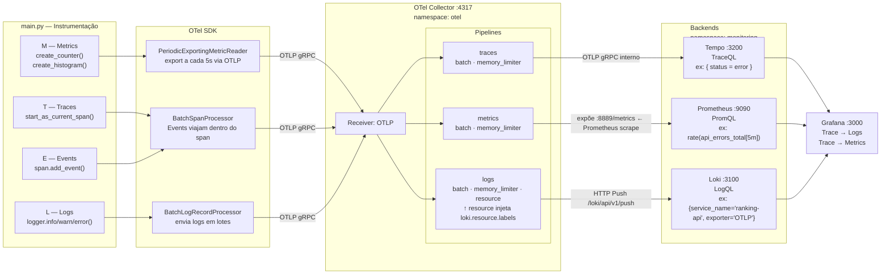

# 🔭 Módulo 04: Instrumentação com OpenTelemetry

## 📋 Índice

1. [Visão Geral](#-visão-geral)
2. [O Problema que o OTel Resolve](#-o-problema-que-o-otel-resolve)
3. [Conceitos Fundamentais](#-conceitos-fundamentais)
4. [Arquitetura do Stack](#-arquitetura-do-stack)
5. [A Aplicação: Ranking API](#-a-aplicação-ranking-api)
6. [Componentes em Detalhe](#-componentes-em-detalhe)
7. [Estrutura do Módulo](#-estrutura-do-módulo)
8. [Início Rápido](#-início-rápido)
9. [O que Observar no Grafana](#-o-que-observar-no-grafana)
10. [Questões de Fixação](#-questões-de-fixação)
11. [Recursos Adicionais](#-recursos-adicionais)

---

## 📚 Visão Geral

No **Módulo 03**, o Prometheus coletava métricas "de fora" — raspando o endpoint `/metrics` dos pods. O Fluent Bit coletava logs "de fora" — lendo arquivos no disco. Nenhuma das ferramentas sabia o que estava acontecendo **dentro** da aplicação.

O **OpenTelemetry (OTel)** inverte essa lógica: a aplicação é instrumentada por dentro e **envia ativamente** métricas, logs e traces para o OTel Collector, que distribui para cada backend.

> 🎬 **Cenário real:** Usuários reclamam que o endpoint `/rankings` está lento às vezes. Com traces, você abre o Grafana Tempo, filtra por duração > 500ms, e vê exatamente qual span dentro da requisição está demorando — é o "db-write" de um jogador específico. Sem traces, você saberia que está lento. Com traces, você sabe **onde** e **por quê**.

---

## 🔥 O Problema que o OTel Resolve

### Vendor Lock-in de Observabilidade

Sem OTel — cada ferramenta tem seu SDK próprio:
```
App com Datadog SDK   → só funciona com Datadog
App com Jaeger SDK    → só funciona com Jaeger
App com New Relic SDK → só funciona com New Relic
```
Trocar de ferramenta = reescrever a instrumentação da aplicação.

### Com OpenTelemetry

```
App com OTel SDK → OTel Collector → Prometheus  (métricas)
                                 → Loki         (logs)
                                 → Tempo/Jaeger (traces)
                                 → Datadog      (todos)
                                 → Elasticsearch (todos)
```
Trocar de backend = muda configuração do Collector. O código da aplicação não muda.

### O que o OTel padroniza

| Antes do OTel | Com OTel |
|---|---|
| Cada ferramenta tem seu formato | Formato único: OTLP (OpenTelemetry Protocol) |
| SDK diferente por vendor | Um SDK para todos os vendors |
| Dados isolados por ferramenta | Correlação entre traces, métricas e logs |

---

## 🧩 Conceitos Fundamentais

### Trace
Um **trace** representa o caminho completo de uma requisição através do sistema.

```
Trace ID: abc-123
├── Span: HTTP GET /rankings              [0ms → 47ms]
│   ├── Span: validar-parametros          [1ms → 3ms]
│   └── Span: db-read (SELECT rankings)   [3ms → 45ms]   ← gargalo aqui
```

### Span
Um **span** é uma unidade de trabalho dentro de um trace. Cada span tem:
- Nome (ex: `db-read`)
- Timestamp de início e fim
- Atributos (ex: `db.table=rankings`, `http.status_code=200`)
- Status (OK ou ERROR)
- Span pai (para construir a hierarquia)

### Context Propagation
Quando uma requisição passa por múltiplos serviços, o **trace ID** é propagado via headers HTTP (`traceparent`). Isso permite correlacionar spans de serviços diferentes no mesmo trace.

```
Serviço A → Serviço B → Serviço C
    |              |              |
    └──────────────┴──────────────┘
          mesmo Trace ID → mesmo gráfico no Grafana
```

### OTLP (OpenTelemetry Protocol)
Protocolo de comunicação padrão do OTel. Os dados (traces, métricas, logs) são enviados via:
- **gRPC** → porta 4317 (recomendado, mais eficiente)
- **HTTP/protobuf** → porta 4318

### OTel Collector
Agente intermediário que recebe dados das aplicações e os encaminha para os backends. Atua como:
- **Buffer:** evita perda de dados em picos
- **Transformador:** enriquece dados com atributos adicionais
- **Roteador:** envia para múltiplos destinos ao mesmo tempo

```
Aplicação → OTLP → Collector → Tempo     (traces)
                             → Prometheus (métricas)
                             → Loki       (logs)
```

---

## 🏗️ Arquitetura do Stack

### Pipeline MELT — da linha de código ao gráfico no Grafana

**MELT** é o acrônimo dos quatro sinais de observabilidade que o OpenTelemetry padroniza:

| Sinal | O que é | Criado com | Destino |
|---|---|---|---|
| **M** — Metrics | Contadores, histogramas, gauges | `meter.create_counter()` / `create_histogram()` | Prometheus |
| **E** — Events | Eventos pontuais dentro de um span | `span.add_event()` | Tempo (junto com o trace) |
| **L** — Logs | Linhas de log estruturadas | `logger.info/warning/error()` | Loki |
| **T** — Traces | Árvore de spans de uma requisição | `tracer.start_as_current_span()` | Tempo |

> **E (Events) na prática:** Span Events são logs acoplados a um span específico — eles viajam junto com o trace, não têm pipeline separado. Úteis para registrar momentos importantes dentro de um span, como "cache invalidado" ou "retry iniciado". Aparecem na linha do tempo do span no Tempo.

---

### Diagrama de fluxo completo



---

### Como cada sinal é extraído no código

```
main.py
│
├── Resource.create({ "service.name": "ranking-api", ... })
│   └── etiqueta permanente colada em M + E + L + T
│       Vira labels em todos os backends:
│       Prometheus: service_name="ranking-api"
│       Loki:       service_name="ranking-api"  (stream label, indexado)
│       Tempo:      resource.service.name = "ranking-api"
│
├── [T] tracer.start_as_current_span("submit-score")
│   ├── span.set_attribute("player.name", req.player)   → atributo no Tempo
│   ├── span.set_status(ERROR, "mensagem")               → span vermelho no waterfall
│   └── [E] span.add_event("validation-failed")         → evento na linha do tempo do span
│
├── [L] logger.error("Score inválido", extra={...})
│   └── Vira {level="ERROR"} no Loki (stream label)
│       Body JSON: {"message": "...", "traceID": "<mesmo ID do span acima>"}
│
└── [M] api_errors.add(1, {"endpoint": "submit_score", "reason": "negative_score"})
    └── Vira api_errors_total{endpoint="submit_score", reason="negative_score"} no Prometheus
```

---

### Correlação entre os sinais no Grafana

O `traceID` é o fio que une os três backends. O OTel SDK injeta o traceID ativo automaticamente:

```
Uma requisição POST /score com score inválido gera:

[T] Span "submit-score"   → Tempo   → traceID: abc-123
[L] logger.error(...)     → Loki    → body JSON: { "traceID": "abc-123", "level": "ERROR" }
[M] api_errors.add(1)     → Prom    → api_errors_total{reason="negative_score"} +1
[E] span.add_event(...)   → Tempo   → evento na linha do span "submit-score"

Grafana Tempo → clique no span → "Logs for this span"
  ↓ monta query: {service_name="ranking-api"} com time range do span
  ↓ abre Loki com o log de erro exato daquela requisição
```

---

### Visão por namespace no cluster

```
┌───────────────────────────────────────────────────────────────────────┐
│                          Kind Cluster                                 │
│                                                                       │
│  namespace: games                                                     │
│  ┌──────────────────────────────────────────────────────────┐        │
│  │  Ranking API (FastAPI + OTel SDK)                        │        │
│  │  ┌─────────────┐  ┌─────────────┐  ┌─────────────┐      │        │
│  │  │  Pod 1      │  │  Pod 2      │  │  Pod N      │      │        │
│  │  │  traces ─┐  │  │  traces ─┐  │  │  traces ─┐  │      │        │
│  │  │  metrics │  │  │  metrics │  │  │  metrics │  │      │        │
│  │  │  logs    │  │  │  logs    │  │  │  logs    │  │      │        │
│  │  └──────────┼──┘  └──────────┼──┘  └──────────┼──┘      │        │
│  └─────────────┼────────────────┼────────────────┼──────────┘        │
│                │ OTLP gRPC      │                │                   │
│                └────────────────┴────────────────┘                   │
│                                 ↓                                    │
│  namespace: otel                                                      │
│  ┌──────────────────────────────────────────────────────────┐        │
│  │  OTel Collector                                          │        │
│  │  receivers: [otlp]                                       │        │
│  │  processors: [batch, memory_limiter]                     │        │
│  │  exporters:                                              │        │
│  └────┬──────────────┬───────────────────┬──────────────────┘        │
│       │              │                   │                           │
│  traces (OTLP)   métricas (prom)     logs (Loki API)                │
│       ↓              ↓                   ↓                           │
│  ┌─────────┐   ┌──────────┐      ┌──────────┐                       │
│  │  Tempo  │   │Prometheus│      │   Loki   │  namespace: monitoring │
│  └────┬────┘   └──────────┘      └──────────┘                       │
│       └──────────────────────────────┐                               │
│                                      ↓                               │
│                               ┌────────────┐                         │
│                               │  Grafana   │ ← métricas + logs +     │
│                               │            │    traces unificados    │
│                               └────────────┘                         │
└───────────────────────────────────────────────────────────────────────┘
         │              │
    localhost:8082  localhost:3200
    (Ranking API)   (Tempo API)
```

---

## 🎮 A Aplicação: Ranking API

Para instrumentar com OTel, precisamos de uma aplicação com **código próprio** — diferente do Super Mario (imagem fechada). A **Ranking API** é um serviço de leaderboard para o Mario:

### Endpoints

| Método | Endpoint | Descrição |
|---|---|---|
| GET | `/health` | Health check |
| GET | `/rankings` | Lista top 10 jogadores |
| POST | `/score` | Submete pontuação |
| GET | `/score/{player}` | Busca pontuação de um jogador |
| GET | `/slow` | Simula endpoint lento (para observar traces) |

### Por que FastAPI?

- Instrumentação automática via `FastAPIInstrumentor` (auto-injeta spans em cada request)
- Simples e didático
- OTel SDK para Python é bem mantido e documentado

### O que está instrumentado

```python
# Cada requisição HTTP → span automático (FastAPIInstrumentor)
GET /rankings → span "GET /rankings" [latência total]
    └── span "db-read"              [latência da consulta]

POST /score   → span "POST /score"  [latência total]
    ├── span "validate-input"       [latência da validação]
    └── span "db-write"             [latência da escrita]
```

---

## 🔩 Componentes em Detalhe

### OTel SDK (na aplicação)
Biblioteca instalada na aplicação que:
- Cria e gerencia spans
- Coleta métricas customizadas
- Captura logs estruturados
- Envia tudo via OTLP para o Collector

**Configuração via variáveis de ambiente (padrão OTel):**
```
OTEL_SERVICE_NAME=ranking-api
OTEL_EXPORTER_OTLP_ENDPOINT=http://otel-collector.otel.svc.cluster.local:4317
OTEL_RESOURCE_ATTRIBUTES=deployment.environment=kind-dev
```

---

### OTel Collector
Processo intermediário que recebe, processa e exporta dados de telemetria.

**Pipeline de dados:**
```
Receiver (OTLP) → Processor (batch) → Exporter (Tempo / Prometheus / Loki)
```

**Por que não enviar direto para o backend?**
> Se a aplicação enviar direto para o Tempo e o Tempo ficar indisponível por 30s, os traces são perdidos. O Collector faz buffer e retry. Além disso, centraliza a configuração de destinos — as aplicações só conhecem o endereço do Collector.

---

### Grafana Tempo
Backend de armazenamento de traces, criado pela Grafana Labs.

**Diferenças do Jaeger:**

| | Tempo | Jaeger |
|---|---|---|
| Storage | Objeto (S3, GCS, local) | Cassandra, ES, Badger |
| Query language | TraceQL | Nenhuma nativa |
| Integração Grafana | Nativa | Via plugin |
| Custo operacional | Baixo | Médio/Alto |
| Ideal para | Stack Grafana | Stack independente |

**TraceQL** — linguagem de query do Tempo:
```
{ span.http.url =~ ".*rankings.*" && duration > 100ms }
{ status = error }
{ resource.service.name = "ranking-api" && span.db.operation = "upsert" }
```

---

## 📁 Estrutura do Módulo

```
modulo-04-opentelemetry/
├── README.md                     ← Este arquivo
├── QUICK-START.md                ← Passo a passo completo
└── manifests/
    ├── README.md                 ← Documentação dos manifestos
    ├── cluster-config.yaml       ← Kind com port mappings adicionais
    ├── app/
    │   ├── main.py               ← FastAPI instrumentada com OTel SDK
    │   ├── requirements.txt      ← Dependências Python
    │   └── Dockerfile            ← Build da imagem
    └── k8s/
        ├── 01-deployment-ranking-api.yaml  ← Deployment da Ranking API
        ├── 02-service-ranking-api.yaml     ← Service (NodePort)
        └── 03-otel-collector.yaml          ← ConfigMap + Deployment + Service
```

---

## 🚀 Início Rápido

Veja o [QUICK-START.md](./QUICK-START.md) para o passo a passo completo.

**Pré-requisitos:**
- ✅ Módulo 03 concluído (Prometheus + Grafana + Loki + Fluent Bit rodando)
- ✅ Docker disponível para build da imagem
- ✅ Kind e kubectl configurados

---

## 👁️ O que Observar no Grafana

### Grafana Tempo — Traces

1. Abra `http://localhost:3000` → **Explore** → Datasource: **Tempo**
2. Query por serviço:
   ```
   { resource.service.name = "ranking-api" }
   ```
3. Filtre por duração alta (endpoints lentos):
   ```
   { resource.service.name = "ranking-api" && duration > 100ms }
   ```
4. Filtre por erros:
   ```
   { resource.service.name = "ranking-api" && status = error }
   ```

### Waterfall de um trace

Ao clicar em um trace, você verá o gráfico de cascata (waterfall):
```
GET /rankings ──────────────────────────── 47ms
  └─ validate-params ──── 2ms
  └─ db-read ──────────────────────── 44ms   ← gargalo visível
```

### Correlação Trace → Logs

O Grafana permite ir de um trace diretamente para os logs daquele pod naquele momento:
1. Clique em um span com erro
2. Clique em **"Logs for this span"**
3. O Grafana abre o Loki filtrado pelo mesmo `trace_id`

---

## 🧪 Questões de Fixação

**Fase 1 — Conceitual**

1. Qual é a diferença entre um **trace** e um **span**? Qual é a relação hierárquica entre os dois?
2. Por que o OTel Collector existe entre a aplicação e o backend? Não seria mais simples enviar direto do app para o Tempo?
3. O que é **context propagation** e por que ele é necessário em arquiteturas de microserviços?

**Fase 2 — Prática**

4. Abra o Grafana Tempo e execute: `{ duration > 200ms }`. Qual endpoint aparece mais frequentemente nos resultados? Faz sentido com o código da aplicação?
5. Chame o endpoint `/slow` algumas vezes e depois filtre no Tempo por `{ span.http.target = "/slow" }`. Descreva o waterfall que você vê — quantos spans existem e o que cada um representa?
6. Force um erro: `POST /score` com `score: -1`. No Tempo, filtre por `{ status = error }`. Quais atributos o span de erro tem que o span de sucesso não tem?

**Fase 3 — Arquitetura**

7. A Ranking API usa `in-memory store` (dados em memória). Se um pod for deletado, os dados são perdidos. O que você adicionaria na arquitetura para resolver isso? Como isso afetaria os traces?
8. Em produção, o OTel Collector pode ser configurado para **amostrar** apenas 10% dos traces (tail-based sampling). Por que fazer isso? Qual é o risco?
9. Você tem 20 microserviços, todos enviando traces para o mesmo Collector. O Collector começa a consumir muita memória. Quais estratégias de deployment do Collector você usaria para resolver isso?

---

## 📖 Recursos Adicionais

- [OpenTelemetry — Documentação oficial](https://opentelemetry.io/docs/)
- [OTel Python SDK](https://opentelemetry-python.readthedocs.io/)
- [Grafana Tempo — Documentação](https://grafana.com/docs/tempo/latest/)
- [TraceQL — Linguagem de query do Tempo](https://grafana.com/docs/tempo/latest/traceql/)
- [OTel Collector — Configuração](https://opentelemetry.io/docs/collector/configuration/)
- [Context Propagation explicado](https://opentelemetry.io/docs/concepts/context-propagation/)
- [Distributed Tracing — Google SRE Book](https://sre.google/sre-book/distributed-tracing/)
